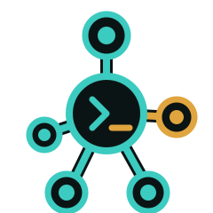
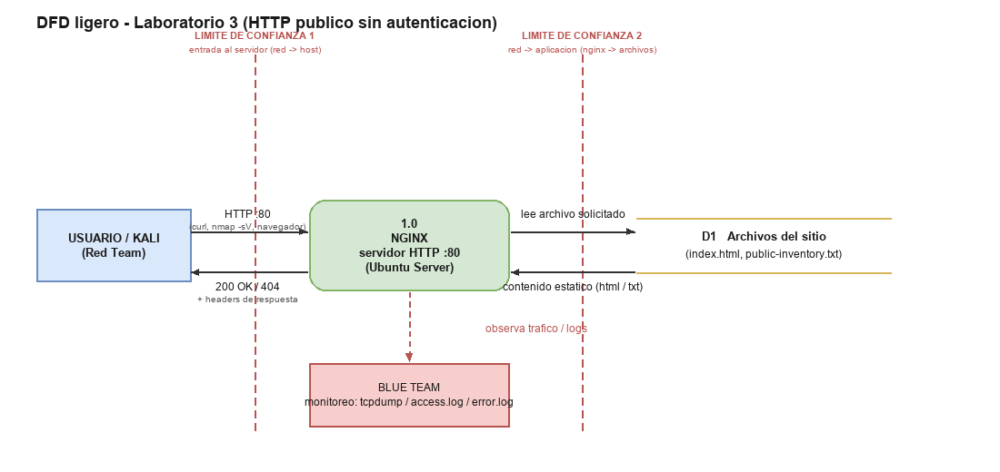
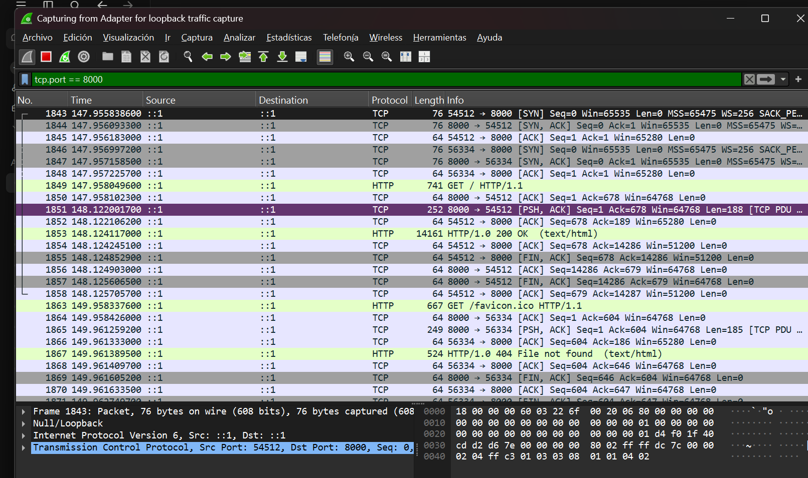

<p align="center">
  
</p>

<h1 align="center">Network Automation Hub</h1>
<p align="center">Laboratorio 3 — Aplicaciones Web / HTTP</p>

## Que es esto

Vamos a construir un prototipo para consultar un inventario ficticio de dispositivos de red (firewalls, routers, switches) y preparar la ejecucion controlada de scripts previamente aprobados sobre ellos. La idea es que quede evidencia clara de quien ejecuto que accion y con que resultado, en vez de que cada quien le meta mano a los equipos por su cuenta.

Durante este laboratorio solo se permiten operaciones de lectura y simulaciones. No se conecta a equipos reales ni se hacen cambios reales todavia.

## En que vamos

El sitio ([`network-automation-hub/index.html`](network-automation-hub/index.html)) es una pagina estatica (sin backend) que documenta los endpoints planeados de la API:

- Inventario de dispositivos
- Scripts aprobados y su validacion
- Ejecucion controlada (simulada), rollback y evidencia/auditoria

Ya esta desplegado de verdad (Fase A completa) y paso por todo el ciclo del lab: reconocimiento Red Team, deteccion Blue Team, hardening y retest. Ver "Arquitectura final" y las carpetas `evidence/` abajo. Implementar los endpoints reales queda para el roadmap del proyecto, no es parte de este laboratorio.

## Arquitectura final

Las dos VMs corren en la misma maquina (la PC de Nicolas), en modo de red **Bridged** en VMware (asi ambas quedan visibles entre si en la red de casa; en la red de la universidad el modo NAT dio problemas de DHCP — si se retoma en otra red y falla, revisar que el modo de adaptador coincida en las dos VMs):

| Rol | Maquina | IP |
|---|---|---|
| Red Team | Kali Linux | `192.168.0.38` |
| Blue Team / host de la app | Ubuntu Server 26.04 + Nginx | `192.168.0.6` |

El sitio se sirve desde `/var/www/network-automation-hub/` (virtual host en `/etc/nginx/sites-available/network-automation-hub`). Firewall (`ufw`) limitado a `192.168.0.0/24` en el puerto 80, SSH abierto.

## DFD (diagrama de flujo de datos)

Flujo minimo del laboratorio: `Usuario/Kali -> red del laboratorio -> Nginx -> archivos del sitio`, con los 2 limites de confianza que pide la guia marcados en rojo (entrada al servidor, y el paso de red a aplicacion). Tambien se ve donde entra Blue Team a monitorear (tcpdump / logs), sin que forme parte del flujo principal.



Fuente editable en [`diagrams/dfd-lab3.drawio`](diagrams/dfd-lab3.drawio) (abrir en [app.diagrams.net](https://app.diagrams.net)).

## Hipotesis STRIDE (Fase B)

Adaptadas al spec de la API ya documentado en [`network-automation-hub/index.html`](network-automation-hub/index.html) (inventario de dispositivos, scripts aprobados, ejecucion controlada):

| ID | STRIDE | Hipotesis tecnica | Validacion |
|----|--------|--------------------|------------|
| H1 | Information Disclosure | `GET /devices` expone el inventario completo (sede, rol, estado) sin autenticacion real — el header `Authorization` del spec es solo documental, nadie lo valida. | **Confirmada** — `curl -i $TARGET_URL/` responde `200 OK` sin ningun token. Ver [evidence/red/curl_home.txt](evidence/red/curl_home.txt). |
| H2 | Information Disclosure | `GET /executions/{id}/evidence` devuelve quien ejecuto que, sobre que dispositivo y la salida capturada; sin control de acceso por operador, alcanzaria con enumerar el `id`. | **Confirmada** (a nivel de servidor) — Nmap y ZAP revelan `nginx 1.28.3 (Ubuntu)` en headers/banner antes del hardening. Corregido despues (ver `risk-register.md`, R2). |
| H3 | Spoofing | Nada valida el `Authorization: Bearer <token>` ni el campo `requestedBy`; cualquiera podria suplantar a `operador.autorizado` al pedir una ejecucion (`SIM /executions`). | Pendiente para Lab 4 — la API aun no esta implementada, solo documentada; se valida cuando exista backend real. |
| H4 | Repudiation | Como no hay verificacion real de identidad, un operador podria negar haber pedido una ejecucion o un rollback: no hay prueba de origen, solo el dato que el propio cliente declaro. | **Mitigada parcialmente** — `access.log` correlacionado identifica IP y User-Agent del origen (ej. Nmap Scripting Engine), pero no identifica al operador humano. Ver [evidence/blue/access-log-nmap-detection.txt](evidence/blue/access-log-nmap-detection.txt). |
| H5 | Tampering | Sin TLS (HTTP plano), un intermediario en la red podria alterar `deviceId`/`scriptId`/`dryRun` en transito en el `POST /executions`, sin que el operador se entere. | **Confirmada** — captura de Wireshark muestra el trafico completo en texto plano, sin cifrar. Pendiente para Lab 4 (HTTPS/TLS). |

## Variables del laboratorio

Valores usados en la ejecucion final (Kali → Ubuntu, red Bridged local):

```bash
export TARGET_IP=192.168.0.6
export TARGET_URL=http://$TARGET_IP
export LAB_CIDR=192.168.0.0/24
```

## Linea de tiempo Purple Team (Paso 14)

| Hora UTC | Accion Red Team | Evidencia Blue Team | Conclusion |
|----------|-------------------|----------------------|------------|
| 22:06:54 | Nmap port 80 + NSE scripts | 4x 404 en `access.log`, mismo segundo | Escaneo automatizado detectado |
| 22:07:06 | curl GET / | 200 en `access.log` | Correlacion confirmada |
| 22:07:17 | curl HEAD /public-inventory.txt | 404 en `access.log` | Ruta inexistente identificada |
| 23:08-23:17 | ZAP Manual Explore (Firefox) | GET /, favicon.ico 404 | Navegacion de exploracion pasiva |

## Captura de trafico HTTP (Wireshark)

Como parte del lab tocaba comprobar que el trafico de la pagina de verdad viaja como HTTP plano. Para eso:

1. Servimos la pagina con un servidor HTTP local (no abrirla como `file://`, porque ahi el navegador no genera trafico de red):
   ```bash
   cd network-automation-hub
   python -m http.server 8000
   ```
2. En Wireshark, capturando sobre el **Adapter for loopback traffic capture** (el trafico a `localhost` no sale por la tarjeta de red normal), aplicamos el filtro:
   ```
   tcp.port == 8000
   ```
3. Con la captura corriendo, se abrio `http://localhost:8000/` en Chrome.

### Lo que se vio filtrado por el puerto 8000



| # paquete | Protocolo | Info |
|---|---|---|
| 1849 | HTTP | `GET / HTTP/1.1` |
| 1853 | HTTP | `HTTP/1.0 200 OK (text/html)` |
| 1863 | HTTP | `GET /favicon.ico HTTP/1.1` |
| 1867 | HTTP | `HTTP/1.0 404 File not found (text/plain)` |

El 404 del `favicon.ico` es esperado, la pagina no tiene uno — el navegador lo pide solo por costumbre.

### HTTP stream completo (Follow → HTTP Stream del paquete GET /)

Request de Chrome y respuesta del servidor, capturados en texto plano porque todo corrio por HTTP sin cifrar:

```
GET / HTTP/1.1
Host: localhost:8000
Connection: keep-alive
sec-ch-ua: "Chromium";v="152", "Not?A_Brand";v="24", "Google Chrome";v="152"
sec-ch-ua-mobile: ?0
sec-ch-ua-platform: "Windows"
Upgrade-Insecure-Requests: 1
User-Agent: Mozilla/5.0 (Windows NT 10.0; Win64; x64) AppleWebKit/537.36 (KHTML, like Gecko) Chrome/152.0.0.0 Safari/537.36
Accept: text/html,application/xhtml+xml,application/xml;q=0.9,image/avif,image/webp,image/apng,*/*;q=0.8,application/signed-exchange;v=b3;q=0.7
Sec-Fetch-Site: none
Sec-Fetch-Mode: navigate
Sec-Fetch-User: ?1
Sec-Fetch-Dest: document
Accept-Encoding: gzip, deflate, br, zstd
Accept-Language: es-US,es-419;q=0.9,es;q=0.8

HTTP/1.0 200 OK
Server: SimpleHTTP/0.6 Python/3.14.6
Date: Wed, 02 Sep 2026 23:36:22 GMT
Content-type: text/html
Content-Length: 14097
Last-Modified: Wed, 02 Sep 2026 23:17:24 GMT

<!DOCTYPE html>
...
```

**Que muestra esto:** que la pagina viaja como HTTP sin cifrar (por eso Wireshark puede leer el texto tal cual), que el navegador manda sus headers normales de una peticion de navegacion (`Sec-Fetch-*`, `User-Agent`, `Accept`), y que el servidor responde `200 OK` con el HTML completo (`Content-Length: 14097`, coincide con el tamano real de `index.html`).
