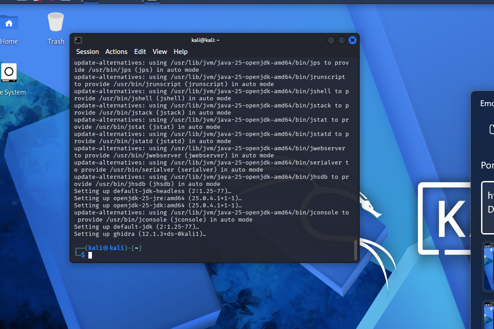
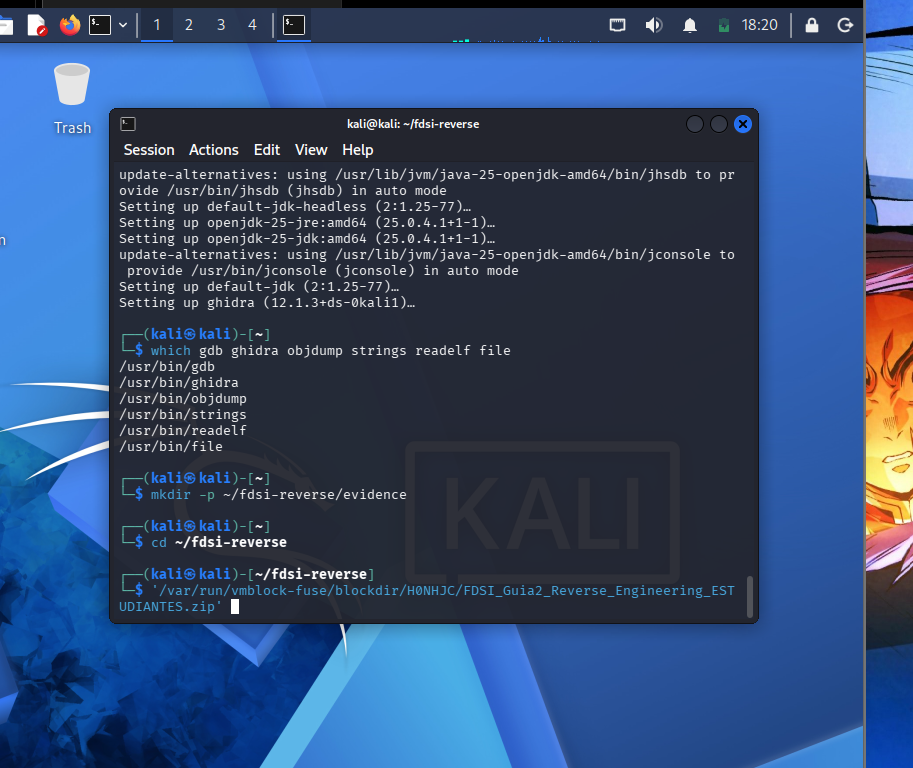
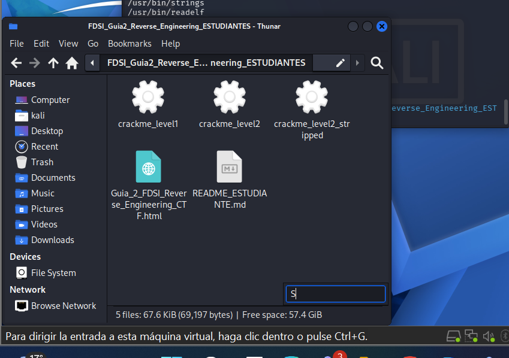
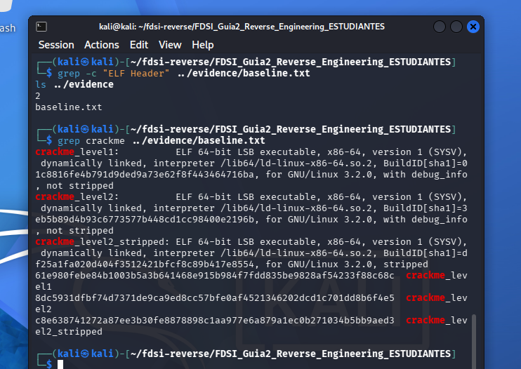
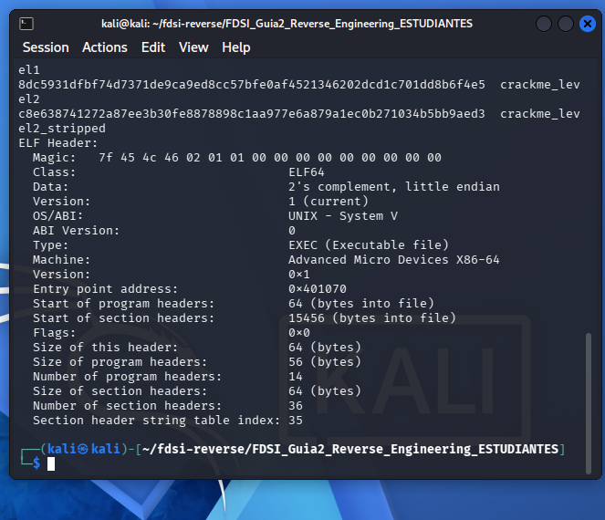

# Lab 4: Reverse Engineering (Guía 2 FDSI)

Aquí está la evidencia de lo que llevamos de la Guía 2 (Reverse Engineering CTF). Todo se hizo en una VM de Kali Linux en VMware.

## Cómo vamos

| Parte | Estado |
|---|---|
| 0. Preparación | Hecha |
| 1. Baseline forense | Hecha |
| 2. Nivel 1 (strings) | Hecha, FLAG obtenida. Detalle en [level1.md](level1.md) |
| 3. Nivel 2 (Ghidra) | Hecha, clave y FLAG obtenidas. Detalle en [level2.md](level2.md) |
| 4. GDB | Hecha, clave mala devuelve 0 y la buena devuelve 1. Detalle en [gdb.md](gdb.md) |
| 5. Boss (stripped) | Pendiente |

## 0. Preparación

Instalé las herramientas con `apt`: `gdb`, `binutils` y `file`, y también Ghidra. Ghidra necesita Java, así que se instaló el JDK 25 junto con él.

Después comprobé con `which` que todas quedaron instaladas y creé la carpeta de trabajo `~/fdsi-reverse/evidence`.

Descomprimí el zip de la guía y quedaron los tres binarios (`crackme_level1`, `crackme_level2` y `crackme_level2_stripped`), el README y la guía en HTML. No abrí ni pedí el código fuente.

## 1. Baseline forense

Corrí `file`, `sha256sum` y `readelf -h` sobre los binarios. Todo quedó guardado en [baseline.txt](baseline.txt).

Los tres son ELF de 64 bits para x86-64 y están enlazados dinámicamente. Los dos primeros tienen símbolos de depuración (`not stripped`). El tercero está `stripped`, o sea que ya no tiene los nombres de las funciones. Eso va a hacer más difícil el Boss.

Los hashes SHA-256 coinciden con los del README del profe:

| Archivo | SHA-256 |
|---|---|
| crackme_level1 | `61e980febe84b1003b5a3b641468e915b984f7fdd835be9828af54233f88c68c` |
| crackme_level2 | `8dc5931dfbf74d7371de9ca9ed8cc57bfe0af4521346202dcd1c701dd8b6f4e5` |
| crackme_level2_stripped | `c8e638741272a87ee3b30fe8878898c1aa977e6a879a1ec0b271034b5bb9aed3` |

Sacamos el hash porque si el archivo cambia aunque sea un byte, el hash es otro. Así nos aseguramos de estar analizando el mismo binario que todos.

## Resumen de resultados

| Nivel | Clave | FLAG |
|---|---|---|
| 1 | `REDTEAM-101` | `FLAG{strings_are_evidence}` |
| 2 | `FDSI-REVERSE-2026` | `FLAG{ghidra_plus_gdb}` |

Lo que sigue es el Boss (el binario sin símbolos) y armar el `reverse-analysis.md`.
