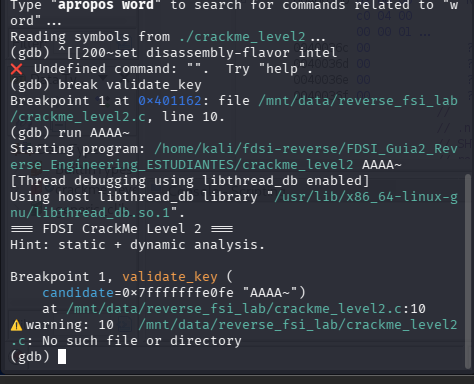
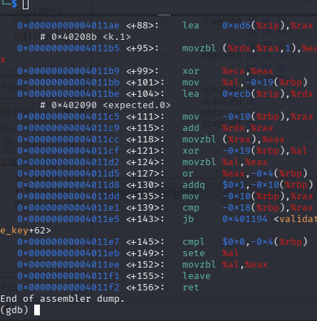
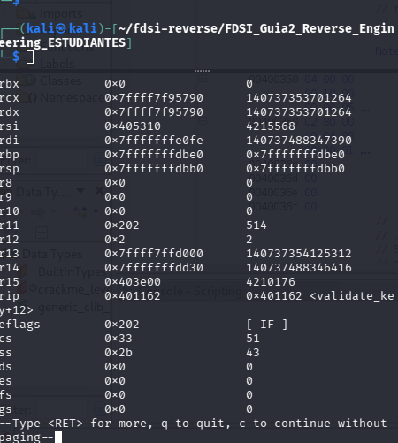
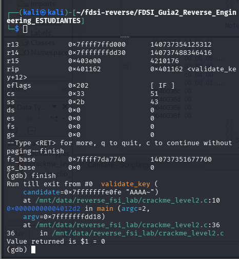
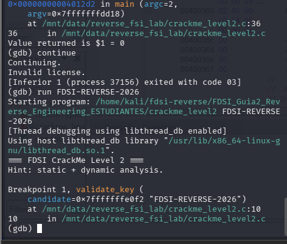
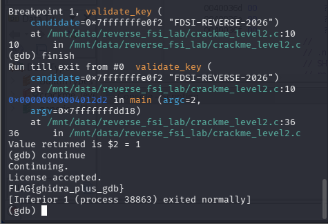

# Confirmación con GDB

Quería comprobar en ejecución lo que encontré en Ghidra. Abrí el programa con `gdb ./crackme_level2` y puse un breakpoint en `validate_key`.

## 1. Clave mala

Corrí `run AAAA`. Por un error al pegar el comando se coló un `~` y la clave quedó como `AAAA~`. Igual sirve como clave mala.

El programa se detuvo dentro de `validate_key`. Se ve la clave en el parámetro `candidate`.

Con `disassemble validate_key` vi el código en ensamblador y lo comparé con Ghidra:

- `movq $0x11, -0x18(%rbp)` guarda el 17, que es el largo esperado.
- `call strlen` y después `cmp` y `je` son el `if (strlen(clave) == 0x11)`.
- `lea` de `<k.1>` y de `<expected.0>` son los dos arreglos.
- `xor` es la operación de cada byte.
- `or %eax,-0x4(%rbp)` es el `score = score | ...`.
- `cmp` y `jb` repiten el ciclo las 17 veces.
- `sete %al` es el `score == 0`.

El primer `set disassembly-flavor intel` falló por el mismo error de pegado, por eso salió en formato AT&T (con `%` y `$`). El contenido es el mismo.

Con `info registers` vi que `rdi` tiene la dirección de la clave (es el primer argumento de la función) y que `rip` está en `validate_key+12`.

Después usé `finish` para ver qué devolvía la función. Dio `Value returned is $1 = 0`, o sea clave inválida. Al hacer `continue` salió `Invalid license.`.

## 2. Clave buena

Repetí con `run FDSI-REVERSE-2026`. Se detuvo otra vez en `validate_key`.

Con `finish` dio `Value returned is $2 = 1`. Con `continue` salió `License accepted.` y la FLAG.

## Qué confirmó GDB

Ghidra me decía qué hacía el código. GDB me dejó ver que de verdad es así: la función devuelve 0 con una clave mala y 1 con la clave que calculé.
