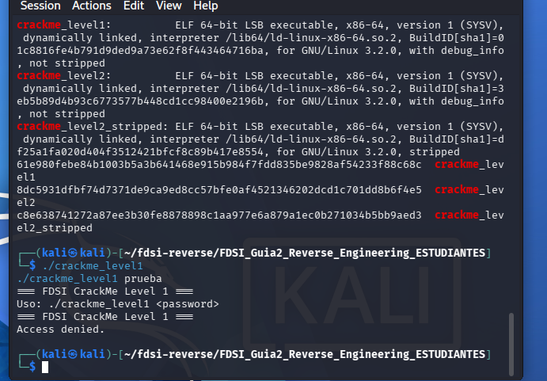
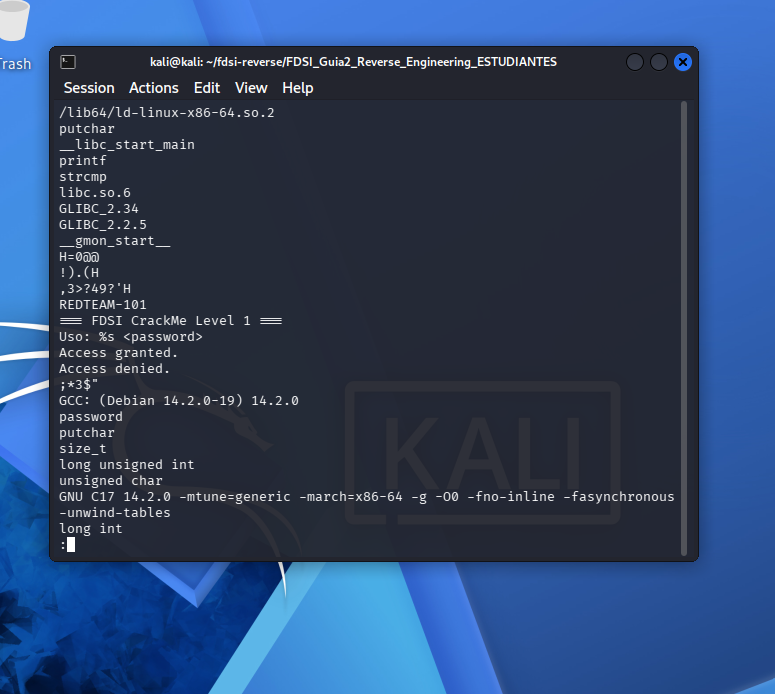
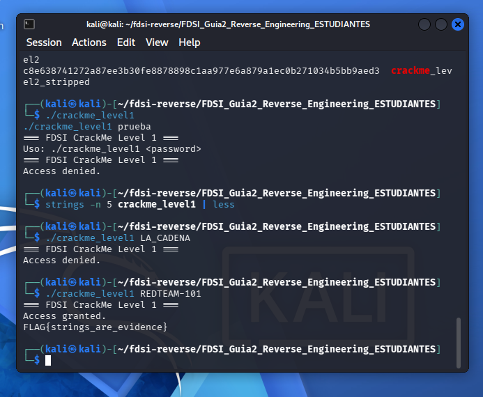

# Nivel 1: strings are evidence

## Hipótesis

Primero ejecuté el programa para ver qué hacía. Sin argumentos mostró `Uso: ./crackme_level1 <password>`. Con una clave inventada (`prueba`) respondió `Access denied.`. Entonces pensé que la clave correcta tenía que estar guardada en algún lado del binario.



## Evidencia

Corrí `strings -n 5 crackme_level1 | less`. Ahí apareció `strcmp`, que sirve para comparar dos textos. También apareció `REDTEAM-101`, justo antes de los mensajes `Access granted.` y `Access denied.`. No parecía un mensaje normal, sino una clave. Con eso sospeché que `strcmp` compara lo que escribo con esa cadena.



## Resultado

Probé con `./crackme_level1 REDTEAM-101` y funcionó. Dio `Access granted.` y mostró la FLAG:

```
FLAG{strings_are_evidence}
```



(En una prueba intermedia escribí `LA_CADENA` en vez de la clave y dio `Access denied.`, pero era solo un error mío con el comando.)

## Por qué es inseguro

Dejar la contraseña escrita dentro del programa es inseguro porque cualquiera puede sacarla con `strings` sin ejecutarlo ni tener el código fuente. Compilar el programa no esconde los textos, solo los pasa a binario.
