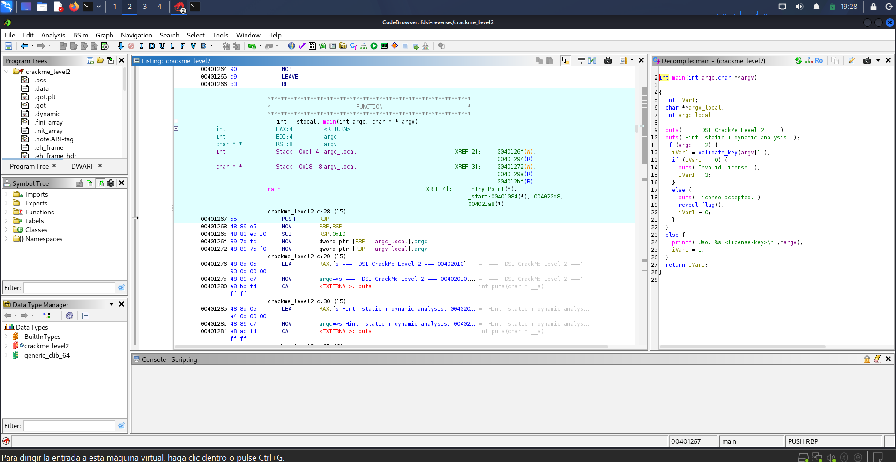
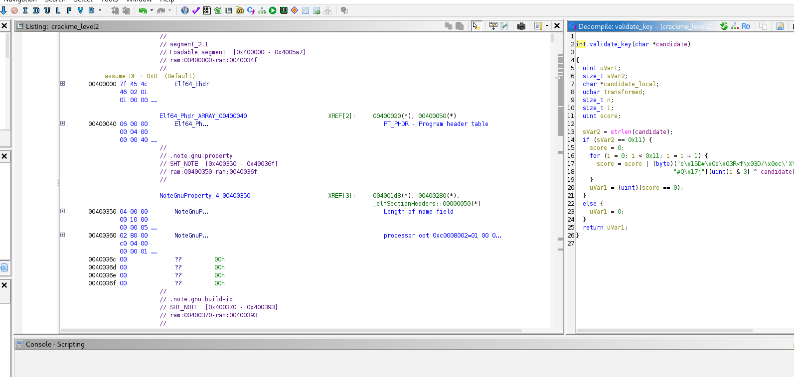
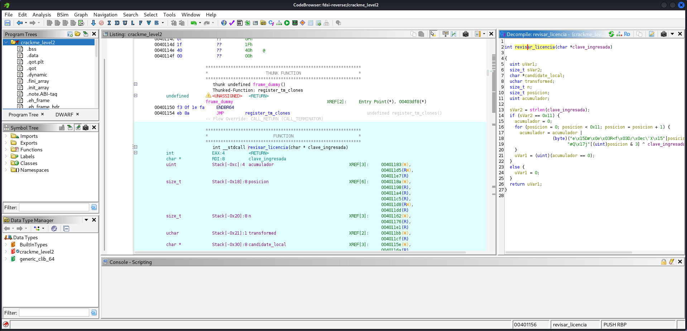
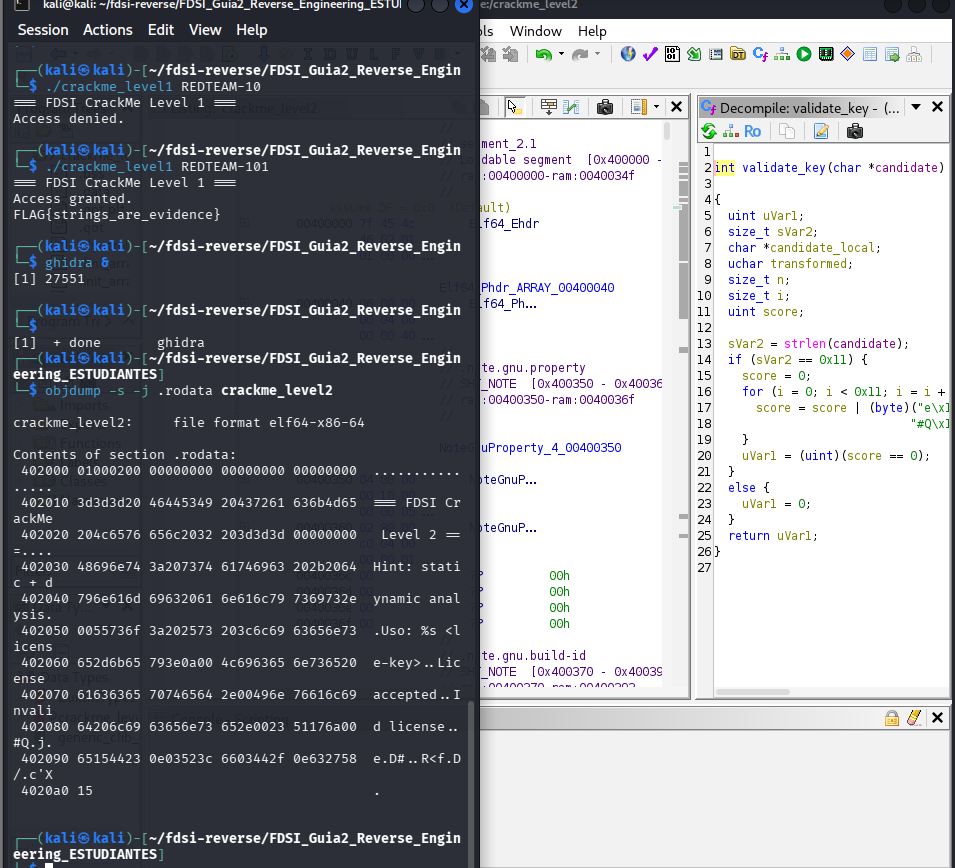
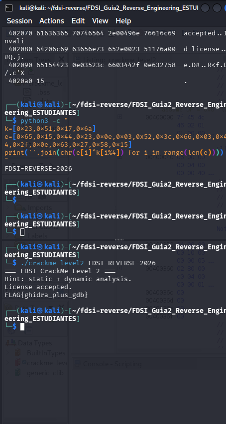

# Nivel 2: Ghidra

## Qué hice

Creé un proyecto Non-Shared en Ghidra (`fdsi-reverse`), importé `crackme_level2` y dejé el análisis automático por defecto.

Empecé por `main`. Ahí se ve que si le pasamos una clave (`argc == 2`) llama a `validate_key(argv[1])`. Si devuelve 0 imprime `Invalid license.`. Si no, imprime `License accepted.` y llama a `reveal_flag()`.



## La función de validación

Después entré a `validate_key`. Lo que entendí:

- Primero mira el largo de la clave. Tiene que ser `0x11`, o sea 17 caracteres. Si no, devuelve 0 de una vez.
- Después recorre la clave posición por posición (de 0 a 16).
- En cada posición hace un XOR de tres cosas: un byte del arreglo `expected`, un byte de un arreglo corto de 4 bytes (`"#Q\x17j"`) y el carácter de la clave.
- El arreglo corto se repite porque usa `posicion & 3`, o sea que da vueltas cada 4.
- Todo eso lo va juntando con un OR en una variable (`score`). Si al final vale 0, la clave es válida.



## Pseudocódigo mío

```
si largo(clave) != 17:
    devolver 0
acumulador = 0
para posicion de 0 a 16:
    acumulador = acumulador OR (expected[posicion] XOR k[posicion % 4] XOR clave[posicion])
devolver (acumulador == 0)
```

Renombré las variables para entenderlas mejor: `candidate` quedó como `clave_ingresada`, `score` como `acumulador`, `i` como `posicion` y `validate_key` como `revisar_licencia`.



## Cómo saqué la clave

Para que el acumulador dé 0, cada XOR tiene que dar 0. Eso pasa cuando `clave[posicion] = expected[posicion] XOR k[posicion % 4]`. El XOR se puede devolver, así que solo hay que hacerlo al revés.

Saqué los bytes de `expected` (17 bytes desde la dirección `0x402090`) con `objdump -s -j .rodata crackme_level2`.



Con un script chiquito en Python:

```python
k = [0x23, 0x51, 0x17, 0x6a]
e = [0x65,0x15,0x44,0x23,0x0e,0x03,0x52,0x3c,0x66,0x03,0x44,0x2f,0x0e,0x63,0x27,0x58,0x15]
print(''.join(chr(e[i] ^ k[i % 4]) for i in range(len(e))))
```

Salió `FDSI-REVERSE-2026`. La probé en el programa y funcionó:

```
./crackme_level2 FDSI-REVERSE-2026
License accepted.
FLAG{ghidra_plus_gdb}
```



## Por qué Ghidra ayudó más que objdump

Con `objdump` solo veía instrucciones sueltas. Ghidra me mostró algo parecido a código en C, con el `for` y el `if`, y eso hizo mucho más fácil entender qué hacía cada parte.
